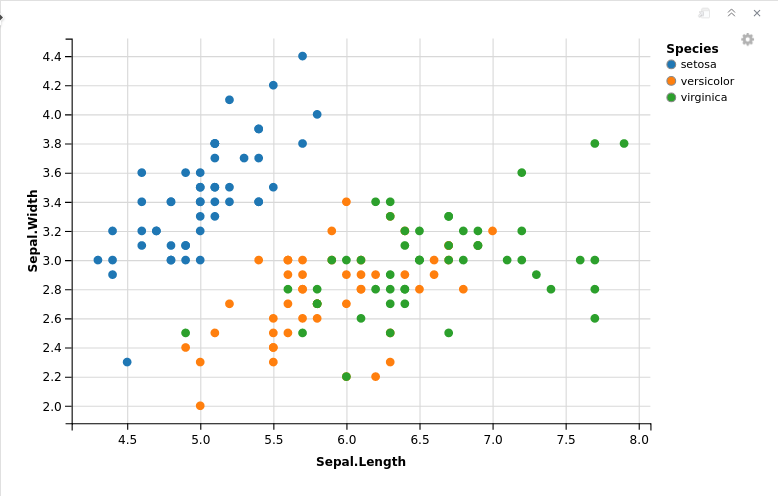
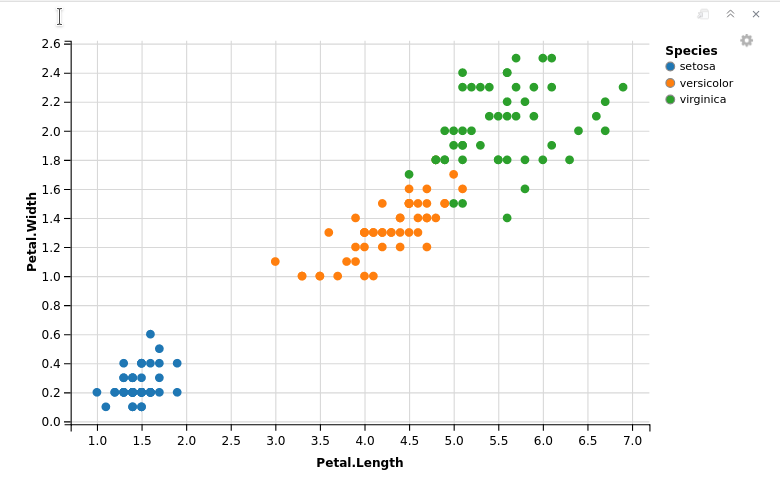

## Introducción

El _Machine Learning_ (o __ML__) o __Aprendizaje Automático__ es una rama de las Ciencias de la Computación que estudia el diseño de algoritmos que puedan aprender. Las tareas típicas del _Aprendizaje Automático_ (en delante __AA__) son el aprendizaje de conceptos, el modelado predictivo, agrupamiento y patrones de búsqueda. Esas tareas se aprenden por medio de conjuntos de datos disponibles a través de la experiencia o por órdenes. Se espera que al incluir la experiencia en sus propias tareas, se mejore el aprendizaje. La meta final es mejorar el aprendizaje de manera que se vuelva automático, para así evitar la interferencia humana.

En este taller conoceremos las bases del _AA_ por medio del software __R__ y su _IDE_ __RStudio__. Para ello, comenzaremos con un algoritmo muy conocido: __KNN__, o _k-nearest neighbors_

## Obteniendo los datos

El _AA_ inicia con datos. Pueden obtenerse a partir de varias fuentes o incluso ser información propia. Arrancaremos con algunos presentes por defecto en _R_.

### Datos incluidos en R

Comenzaremos con un conjunto de datos presente en el propio software: __Iris__. _Iris_ es bastante conocido en _AA_, debido a su tamaño y facilidad de uso. Para cargar el conjunto de datos basta con escribir lo siguiente en la consola:

```{r}
iris
```

_R_ nos mostrará un conjunto de datos un poco grande, de 150 observaciones y con nombres de columna bien definidos (en inglés).

## Conociendo los datos

Una vez cargados los datos, vamos a darles un vistazo para tratar de entender de qué van. Y aquí es precisamente donde lo "heredado" del __Data Science__ cobra sentido: solo ver o leer no es suficiente para comenzar. Necesitamos explorar y visualizar el conjunto de datos, incluso profundizar en el conocimiento del mismo. Nuestro _dataset_ consiste de observaciones de una especie de plantas llamadas _iris_, cuyas flores son bastante llamativas y muy variadas. Solo como recordatorio, las flores contienen sépalos y pétalos. Los primeros son verdes y con forma de hoja, rodeando a las flores más pequeñas. Y los pétalos son de colores llamativos.

Es un tanto difícil distinguir las especies de iris que contiene nuestro _dataset_. Pero por nuestro bien, es mejor conocer las diferencias. No podemos enseñar algo que ni nosotros mismos conocemos bien.

### Un primer vistazo a nuestro _dataset_

Hagamos algunos gráficos para tratar de tener una mejor idea de con qué estamos tratando. Comencemos con unos diagramas de dispersión, con el objetivo de conocer qué tanto afecta una variable a otra. Es decir, veremos si existe una correlación entre dos variables. Iniciemos con la instalación de paquetes que expanden la funcionalidad de _R_. El primero será precisamente el que utilizaremos para generar un diagrama de dispersión atractivo: _ggvis_. Lo instalamos mediante el menú `Tools -> Install packages`.

Una vez instalado, debemos cargarlo en memoria. Tenemos dos opciones:

1. Ir al panel inferior derecho, en la pestaña _Packages_. En la parte superior de dicho panel se encuentra una caja de búsqueda. Escribimos allí _ggvis_ y nos lo muestra junto con una leve descripción. Damos check al lado del nombre del paquete y listo.

2. En la consola escribimos `library(ggvis)`.

Independientemente del método empleado, en la consola no debería aparecer algún mensaje de error. Ahora bien, escribimos el siguiente comando:

```
library(ggvis)
iris %>% ggvis(~Sepal.Length, ~Sepal.Width, fill = ~Species) %>% layer_points()
```


Aquí podemos observar que existe una fuerte correlación entre la longitud y la anchura del sépalo en la especie _Setosa_, no así con las _Versicolor_ o _Virginica_. Tracemos ahora otro diagrama de dispersión pero con los datos que corresponden a los pétalos:

```
iris %>% ggvis(~Petal.Length, ~Petal.Width, fill = ~Species) %>% layer_points()
```


Estos diagramas indican que existe una correlación positiva entre la longitud y la anchura de los pétalos, para todas las especies de iris que están disponibles en nuestra muestra. Pero eso es solo el resultado de una observación, probemos esta hipótesis para asegurarnos de que dicha correlación existe en realidad.

Calculemos la correlación entre las variables estudiadas. Primero la existente entre la anchura y longitud de los sépalos:

```{r}
cor(iris$Petal.Length, iris$Petal.Width)
```

Muy importante notar que el coeficiente de correlación entre dichas variables es muy alto, del orden del 96.28%. Solo para recordar, la correlación ideal es igual a 1.

Ahora vamos a extraer de manera _ordenada_ los datos para analizarlos mejor. Busquemos los niveles (es decir, las etiquetas de las especies) que se encuentran en nuestro dataset _iris_ en su columna _Species_ y los asignamos a $x$. Enseguida invocamos a dicha variable y mostramos su valor:

```{r}
x=levels(iris$Species)
x
```

Vamos a limitar los datos ahora a una sola especie y luego calcular su matriz de correlación. Primero por la _Setosa_:

```{r}
print(x[1])
cor(iris[iris$Species==x[1],1:4])
```

La _versicolor_:

```{r}
print(x[2])
cor(iris[iris$Species==x[2],1:4])
```

Y la _Virginica_:

```{r}
print(x[3])
cor(iris[iris$Species==x[3],1:4])
```

Los coeficientes de correlación son menores por separado que todos juntos. Por ejemplo, para la _Setosa_ tenemos un coeficiente de 0.3316.

Si quisiéramos ver el listado de los datos, nos daremos cuenta de que no nos dice gran cosa. Si es solo con la intención de echar un vistazo a los datos en cuanto a su estructura, resulta mejor hacerlo con el comando 

```{r}
head(iris,5)
```

Este comando nos da una vista previa del dataset que ponemos como primer argumento. El segundo es el número de filas que queremos observar. Aún así, para una observación más profunda, es mejor utilizar el comando

```{r}
str(iris)
```

La razón del porqué es mejor se muestra de inmediato. No solo nos devuelve algunas observaciones del dataset, sino que además nos indica cuántas observaciones y variables tenemos, el nombre de las variables y en especial, el tipo de dato. Podemos notar que los primeros cuatro son numéricos mientras que el último es un factor. Incluso nos indica los niveles de dicho factor. Esto es bastante conveniente, ya que muchos clasificadores _Machine Learning_ requieren que la propiedad objetivo esté codificado como factor. Recordemos pues que las variables tipo factor representan variables categóricas en _R_. Si quisiéramos obtener una tabla de frecuencias absolutas de las especies, lo podemos hacer con:

```{r}
table(iris$Species)
```

Notemos que esto cuenta la cantidad de repeticiones de cada factor. Si lo que queremos es una tabla de frecuencias relativas, podemos obtenerla con:

```{r}
prop.table(table(iris$Species))
```

Y si queremos que se exprese en porcentajes con redondeo a dos dígitos, simplemente agregamos el comando `round ` con la tabla anterior, una  multiplicación por 100 y el argumento de los dígitos o números decimales:

```{r}
round(prop.table(table(iris$Species)) * 100, digits = 2)
```

### Un entendimiento más profundo de los datos

_R_ nos permite cavar más profundamente en nuestro _dataset_. El comando `summary` nos devuelve el valor más pequeño, los cuartiles y el valor máximo para variables numéricas; el conteo para las categóricas:

```{r}
summary(iris)
```

Si en un momento dado necesitamos el _resumen_ de columnas específicas, podemos refinar el comando de la siguiente manera:

```{r}
summary(iris[c("Petal.Width", "Sepal.Width")])
```

El comando `c()` concatena las dos columnas especificadas y muestra solo el resumen de dichas columnas.

## ¿Qué hacer con los datos?

Una vez conocidos los datos, toca decidir qué hacer con ellos, es decir, qué podrían enseñarnos o qué podríamos aprender de ellos. En este caso, podríamos formular un modelo predictivo que nos permita clasificar con base en las especies. También podríamos generar un modelo de regresión con los datos numéricos. En este caso, el atributo categórico `Species` es el que convertiremos en el atributo objetivo. O sea, vamos a predecir.

## Preparando el espacio de trabajo

Muchos de los algoritmos usados en _Machine Learning_ no se encuentran instalados por defecto en _R_. Así que debemos instalarlos. En nuestro caso, para mostrar el algoritmo _KNN_ trabajaremos con el paquete `class`.

## Preparando los datos

Enfoquémonos en la tarea principal: un modelo de _Machine Learning_. Para ello, debemos preparar los datos: normalizarlos y distribuirlos en dos conjuntos: uno de entrenamiento y otro de validación.

### Normalización

Es probable que los datos deban ser normalizados para volverlos consistentes o coherentes. Un _dataset_ consistente lo hace más sencillo para el aprendizaje del algoritmo. Existen dos tipos de normalización:

- Normalización de ejemplo: es el ajuste de cada ejemplo de manera individual.

- Normalización de propiedad: se ajusta cada característica de la misma manera a través de todos los ejemplos.

Si tenemos la sospecha de que los datos no son coherentes, hay que normalizar. ¿Cuándo podemos sospechar? Cuando observemos el resumen de los datos y notemos que una de las variables tiene un amplio rango de valores. Esto implica que la distancia sea dominada por esta característica. 

Es difícil distinguir si un _dataset_ requiere ser normalizado para un ojo no entrenado. En especial si apenas se comienza con el _Aprendizaje Automático_. Así que crearemos una función en _R_ que nos permita normalizar nuestro conjunto de datos actual.

```{r}
normaliza <- function(x) {
  numerador <- x - min(x)
  denominador <- max(x) - min(x)
  return(numerador/denominador)
}
```

Ahora aplicamos esta función al _dataset_ y calculamos su resumen:

```{r}
iris_normalizado <- as.data.frame(lapply(iris[1:4], normaliza))
summary(iris_normalizado)
```

Aún así podemos observar que nuestros datos en realidad no necesitaban ser normalizados.

### Conjunto de entrenamiento y validación

Dividamos el conjunto de datos en dos partes: una para entrenamiento y otra para la validación. El primero nos servirá para entrenar al sistema, mientras que el segundo servirá para evaluar el sistema entrenado. La divisón no es simétrica, usualmente se utiliza una proporción de $\approx 66.66%$ para el set de entrenamiento y lo restante para la validación.

La separación del conjunto de datos debe ser totalmente aleatoria, por lo cual debemos crear una _semilla random_ (generadora de números aleatorios que permite la replicabilidad de cada experimento). Esto nos permitirá escoger cada fila totalmente al azar:

```{r}
set.seed(1234)
```

Ahora utilizaremos la función `sample()`, la cual crea un muestreo aleatorio de nuestros datos. La asignaremos a una variable, la cual estará tomando un número, dos o uno

```{r}
identificador <- sample(2, nrow(iris), replace=TRUE, prob=c(0.67, 0.33))
```

Con esta expresión le asignamos un valor de uno o dos, a todas las filas que componen el conjunto de datos (en este caso, son 150), aplicamos verdadero al reemplazamiento para que al momento de asignar un uno o un dos lo reinicie. Por último, en el argumento de `prob` hacemos la partición.

Creamos el set de entrenamiento:

```{r}
iris.training <- iris[identificador==1, 1:4]
```

Veamos sus datos:

```{r}
head(iris.training)
```

Ahora con el set de validación:

```{r}
iris.test <- iris[identificador==2, 1:4]
```

Y sus datos:

```{r}
head(iris.test)
```

Como lo que nos importa son las especies, almacenaremos las etiquetas en vectores de factores y las distribuiremos sobre los sets de entrenamiento y validación. Primero los del set de entrenamiento:

```{r}
iris.trainLabels <- iris[identificador==1,5]
print(iris.trainLabels)
```

Y enseguida los de validación:

```{r}
iris.testLabels <- iris[identificador==2, 5]
print(iris.testLabels)
```

## El modelo KNN

### Construyendo el clasificador

Hasta ahora no hemos ejecutado ningún algoritmo de aprendizaje. Pero es momento de encontrar el vecino más cercano del set de entrenamiento.

Una manera sencilla es utilizar la función `knn()`, la cual utiliza la distancia euclidiana para encontrar los vecinos más cercanos a la nueva instancia. El parámetro `k` es definido por nosotros.

Las nuevas instancias son clasificadas buscando la mayoría o la ponderación. En caso de clasificaciones, el dato con el mayor puntaje gana y la instancia desconocida recibe la etiqueta de ese punto de datos. Si existe empate, la clasificación es aleatoria.

Tomemos nuestra función `knn()` y simplemente le agregamos unos cuantos argumentos:

```{r}
library(class)
iris_pred <- knn(train = iris.training, test = iris.test, cl = iris.trainLabels, k=3)
iris_pred
```

Almacenamos la predicción en una variable llamada `iris_pred`. Allí solo colocamos las etiquetas del set de entrenamiento. Las de validación las usaremos más adelante, para evaluar nuestro modelo. El resultado de esta función es un vector de factores con las clases predichas para cada fila de los datos de prueba.

Es decir, a partir de los datos de entrenamiento y sin conocer las etiquetas del conjunto de datos de prueba, el algoritmo trata de clasificar los últimos datos con base en las características de entrenamiento.

## Evaluación del modelo

Un paso esencial en el _Machine Learning_ es la evaluación del rendimiento del modelo. En otras palabras, se quiere analizar el grado de exactitud de las predicciones del modelo.

Comparemos los resultados del algoritmo con las etiquetas del conjunto de prueba (recordemos que no las hemos modificado y que el algoritmo no las conoce):

```{r}
irisTestLabels <- data.frame(iris.testLabels)
compara <- data.frame(iris_pred, iris.testLabels)
names(compara) <- c("Predicted Species", "Observed Species")
compara
```

Esta es una indicación del rendimiento, pero si queremos profundizar podemos instalar y ejecutar otro paquete: `gmodels`.

Con esto obtendremos una tabla cruzada, la cual nos mostrará de manera más concisa los posibles errores del modelo y las relaciones entre las clases del set de prueba y las clases del modelo en sí.

```{r}
library(gmodels)
CrossTable(x = iris.testLabels, y = iris_pred, prop.chisq=FALSE)
```

## El paquete `caret`


In the previous sections, you have gotten started with supervised learning in R via the KNN algorithm. As you might not have seen above, machine learning in R can get really complex, as there are various algorithms with various syntax, different parameters, etc. Maybe you’ll agree with me when I say that remembering the different package names for each algorithm can get quite difficult or that applying the syntax for each specific algorithm is just too much.

That’s where the caret package can come in handy: it’s short for “Classification and Regression Training” and offers everything you need to know to solve supervised machine learning problems: it provides a uniform interface to a ton of machine learning algorithms. If you’re a bit familiar with Python machine learning, you might see similarities with scikit-learn!

In the following, you’ll go through the steps as they have been outlined above, but this time, you’ll make use of caret to classify your data. Note that you have already done a lot of work if you’ve followed the steps as they were outlined above: you already have a hold on your data, you have explored it, prepared your workspace, etc. Now it’s time to preprocess your data with caret!

As you have done before, you can study the effect of the normalization, but you’ll see this later on in the tutorial.

You already know what’s next! Let’s split up the data in a training and test set. In this case, though, you handle things a little bit differently: you split up the data based on the labels that you find in iris$Species. Also, the ratio is in this case set at 75-25 for the training and test sets.

```{r}
library(caret)
index <- createDataPartition(iris$Species, p=0.75, list=FALSE)
```

```{r}
iris.training <- iris[index,]
```

```{r}
iris.test <- iris[-index,]
```

You’re all set to go and train models now! But, as you might remember, caret is an extremely large project that includes a lot of algorithms. If you’re in doubt on what algorithms are included in the project, you can get a list of all of them. Pull up the list by running names(getModelInfo()), just like the code chunk below demonstrates. Next, pick an algorithm and train a model with the train() function:

```{r}
names(getModelInfo())
```

```{r}
model_knn <- train(iris.training[, 1:4], iris.training[, 5], method='knn')
```

Note that making other models is extremely simple when you have gotten this far; You just have to change the method argument, just like in this example:

```
model_cart <- train(iris.training[, 1:4], iris.training[, 5], method='rpart2')
```
Now that you have trained your model, it’s time to predict the labels of the test set that you have just made and evaluate how the model has done on your data:

```{r}
predictions<-predict.train(object=model_knn,iris.test[,1:4], type="raw")
```

```{r}
table(predictions)
```

```{r}
confusionMatrix(predictions,iris.test[,5])
```

Additionally, you can try to perform the same test as before, to examine the effect of preprocessing, such as scaling and centering, on your model. Run the following code chunk:

```{r}
model_knn <- train(iris.training[, 1:4], iris.training[, 5], method='knn', preProcess=c("center", "scale"))
```

```{r}
predictions<-predict.train(object=model_knn,iris.test[,1:4], type="raw")
```

```{r}
confusionMatrix(predictions,iris.test[,5])
```

## Otros modelos

Creamos otra lista:

```{r}
validation_index <- createDataPartition(iris$Species, p=0.80, list=FALSE)
```

Creamos el grupo de validación:

```{r}
validation <- iris[-validation_index,]
```

Ahora el grupo de entrenamiento:

```{r}
dataset <- iris[validation_index,]
```

### Resumiendo los datos

#### Dimensiones del conjunto de datos

¿De cuántos elementos consta nuestro _dataset_?

```{r}
dim(dataset)
```

#### Tipos de atributos
Enlistamos los atributos:

```{r}
sapply(dataset, class)
```

#### ¿Cómo son los datos?

Un vistazo rápido:

```{r}
head(dataset)
```

#### Niveles de las clases

```{r}
levels(dataset$Species)
```

#### Distribución de la clase

```{r}
percentage <- prop.table(table(dataset$Species)) * 100
cbind(freq=table(dataset$Species), percentage=percentage)
```

#### Resumen estadístico

```{r}
summary(dataset)
```

### Visualizando de nuevo

#### Gráficas univariables

```{r}
x <- dataset[,1:4]
y <- dataset[,5]
```

```{r}
par(mfrow=c(1,4))
  for(i in 1:4) {
  boxplot(x[,i], main=names(iris)[i])
}
```

#### Gráficas multivariables

```{r}
featurePlot(x=x, y=y, plot="ellipse")
```

```{r}
featurePlot(x=x, y=y, plot="box")
```

```{r}
scales <- list(x=list(relation="free"), y=list(relation="free"))
featurePlot(x=x, y=y, plot="density", scales=scales)
```

### Evaluando modelos

Now it is time to create some models of the data and estimate their accuracy on unseen data.

Here is what we are going to cover in this step:

1. Set-up the test harness to use 10-fold cross validation.
2. Build 5 different models to predict species from flower measurements
3. Select the best model.

#### Test Harness

We will 10-fold crossvalidation to estimate accuracy.

This will split our dataset into 10 parts, train in 9 and test on 1 and release for all combinations of train-test splits. We will also repeat the process 3 times for each algorithm with different splits of the data into 10 groups, in an effort to get a more accurate estimate.

```{r}
control <- trainControl(method="cv", number=10)
metric <- "Accuracy"
```

We are using the metric of “Accuracy” to evaluate models. This is a ratio of the number of correctly predicted instances in divided by the total number of instances in the dataset multiplied by 100 to give a percentage (e.g. 95% accurate). We will be using the metric variable when we run build and evaluate each model next.

#### Construyendo los modelos

We don’t know which algorithms would be good on this problem or what configurations to use. We get an idea from the plots that some of the classes are partially linearly separable in some dimensions, so we are expecting generally good results.

Let’s evaluate 5 different algorithms:

- Linear Discriminant Analysis (LDA)
- Classification and Regression Trees (CART).
- k-Nearest Neighbors (kNN).
- Support Vector Machines (SVM) with a linear kernel.
- Random Forest (RF)

This is a good mixture of simple linear (LDA), nonlinear (CART, kNN) and complex nonlinear methods (SVM, RF). We reset the random number seed before reach run to ensure that the evaluation of each algorithm is performed using exactly the same data splits. It ensures the results are directly comparable.

Let’s build our five models:

```{r}
# a) linear algorithms
set.seed(7)
fit.lda <- train(Species~., data=dataset, method="lda", metric=metric, trControl=control)
# b) nonlinear algorithms
# CART
set.seed(7)
fit.cart <- train(Species~., data=dataset, method="rpart", metric=metric, trControl=control)
# kNN
set.seed(7)
fit.knn <- train(Species~., data=dataset, method="knn", metric=metric, trControl=control)
# c) advanced algorithms
# SVM
set.seed(7)
fit.svm <- train(Species~., data=dataset, method="svmRadial", metric=metric, trControl=control)
# Random Forest
set.seed(7)
fit.rf <- train(Species~., data=dataset, method="rf", metric=metric, trControl=control)
```

#### Eligiendo el mejor modelo

We now have 5 models and accuracy estimations for each. We need to compare the models to each other and select the most accurate.

We can report on the accuracy of each model by first creating a list of the created models and using the summary function.

```{r}
results <- resamples(list(lda=fit.lda, cart=fit.cart, knn=fit.knn, svm=fit.svm, rf=fit.rf))
summary(results)
```

We can also create a plot of the model evaluation results and compare the spread and the mean accuracy of each model. There is a population of accuracy measures for each algorithm because each algorithm was evaluated 10 times (10 fold cross validation).

```{r}
dotplot(results)
```

The results for just the LDA model can be summarized.

```{r}
print(fit.lda)
```

#### Hagamos predicciones

The LDA was the most accurate model. Now we want to get an idea of the accuracy of the model on our validation set.

This will give us an independent final check on the accuracy of the best model. It is valuable to keep a validation set just in case you made a slip during such as overfitting to the training set or a data leak. Both will result in an overly optimistic result.

We can run the LDA model directly on the validation set and summarize the results in a confusion matrix.

```{r}
predictions <- predict(fit.lda, validation)
confusionMatrix(predictions, validation$Species)
```

We can see that the accuracy is 100%. It was a small validation dataset (20%), but this result is within our expected margin of 97% +/-4% suggesting we may have an accurate and a reliably accurate model.

